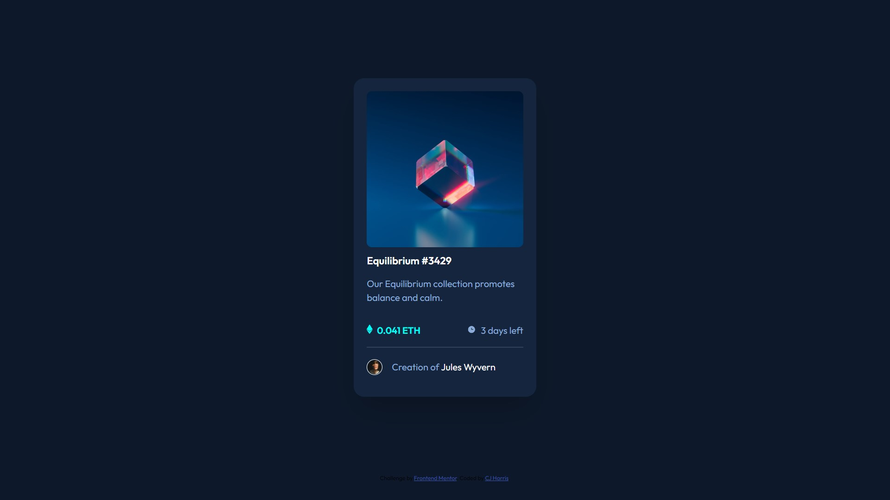

# Frontend Mentor - NFT preview card component solution

This is a solution to the [NFT preview card component challenge on Frontend Mentor](https://www.frontendmentor.io/challenges/nft-preview-card-component-SbdUL_w0U). Frontend Mentor challenges help you improve your coding skills by building realistic projects.

## Table of contents

- [Overview](#overview)
  - [The challenge](#the-challenge)
  - [Screenshot](#screenshot)
  - [Links](#links)
  - [Built with](#built-with)
  - [What I learned](#what-i-learned)
  - [Useful resources](#useful-resources)
- [Author](#author)
- [Acknowledgments](#acknowledgments)

## Overview

### The challenge

Users should be able to:

- View the optimal layout depending on their device's screen size
- See hover states for interactive elements

### Screenshot

### Links

- Solution URL: [Add solution URL here](https://your-solution-url.com)
- Live Site URL: [Add live site URL here](https://your-live-site-url.com)

### Built with

- Semantic HTML5 markup
- CSS custom properties
- Flexbox
- CSS Grid
- Desktop-first workflow

### What I learned

This one was easy before hitting the Hover effects. A bit tricky but I know that should be able to streamline it next time I encounter a problem like this.

### Useful resources

- [How to Image Hover Overlay Effect](https://www.w3schools.com/howto/howto_css_image_overlay.asp) - This resource helped sort out my Hover Effects.

## Author

- Frontend Mentor - [@a=caylemh](https://www.frontendmentor.io/profile/caylemh)

## Acknowledgments

Thanks to Frontend Mentor for these awesome challenges.
